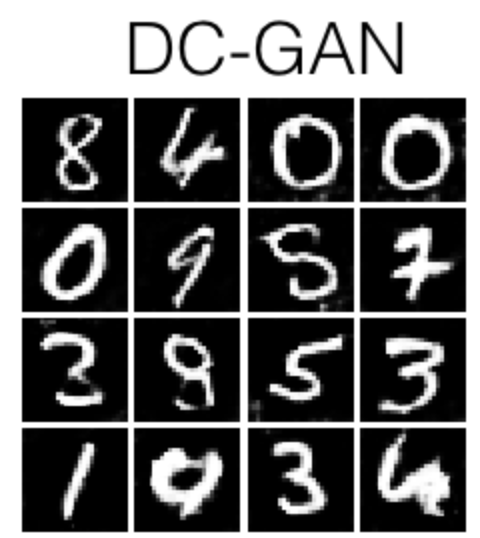

# DCGAN

DCGAN Implementation with MNIST



### Data used : The classic MNIST dataset.


### Models

#### Discriminator :

Layers:
```
* Conv2D: 32 Filters, 5x5, Stride 1, padding 0
* Leaky ReLU(alpha=0.01)
* Max Pool 2x2, Stride 2
* Conv2D: 64 Filters, 5x5, Stride 1, padding 0
* Leaky ReLU(alpha=0.01)
* Max Pool 2x2, Stride 2
* Flatten
* Fully Connected with output size 4 x 4 x 64
* Leaky ReLU(alpha=0.01)
* Fully Connected with output size 1
```

#### Generator :

Layers:

```
* Fully connected with output size 1024
* `ReLU`
* BatchNorm
* Fully connected with output size 7 x 7 x 128
* `ReLU`
* BatchNorm
* Resize into Image Tensor of size 7, 7, 128
* Conv2D^T (transpose): 64 filters of 4x4, stride 2
* `ReLU`
* BatchNorm
* Conv2d^T (transpose): 1 filter of 4x4, stride 2
* `TanH`
```


## Running

***Recommended to use an environment***

I am using Python version 3.7


1. Clone the repository

2. Install the requirements at requirements.txt

    ```
    pip install -r requirements.txt
    ```


3. Train and save image!

```
cd Code
python3 main.py
```

#### Optional arguments:

```
LEARNING_RATE : -lr, --learning_rate : Learning Rate in Adam. Default=1e-3
BETA_1 : -b, --beta1 : Beta in Adam. Default=0.5
EPOCHS : -e, --epochs : Epochs. Default=10
BATCH_SIZE : -bs, --batch_size : Batch Size. Default =128
NOISE_SIZE : -ns, --noise_size : Noise Size. Default=96
PRINT_EVERY : -p, --print_every : Print at how many steps. Default=20
```

#### Repository structure :

```

.
├── Code
│   ├── data_helper.py
│   ├── gan.py
│   ├── loss.py
│   ├── main.py
│   ├── models.py
│   └── utils.py
├── Images
│   └── MNIST_example.png
├── README.md
└── requirements.txt
```
